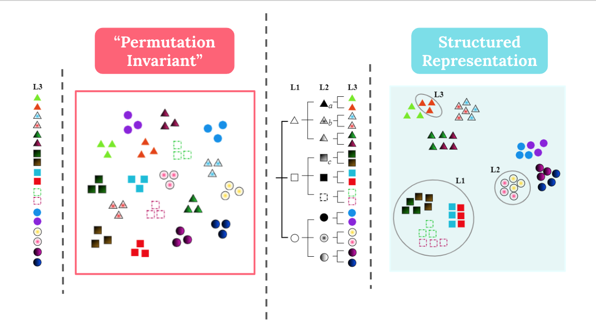

# HierachyCPCC
This is the codebase for [Learning Structured Representations by Embedding Class Hierarchy](https://openreview.net/forum?id=7J-30ilaUZM&referrer=%5BAuthor%20Console%5D(%2Fgroup%3Fid%3DICLR.cc%2F2023%2FConference%2FAuthors%23your-submissions)).

## Introduction
Label hierarchies, which encode the semantic relationship between objects, are widely available in modern ML datasets. To leverage such information in feature representation, we introduce CPCC as a regularizer to convert the traditional permutation invariant feature into a structured representation. CPCC is defined to be the correlation coefficient of two pairwise metrics $t(\cdot, \cdot)$ and $\rho(\cdot, \cdot)$. Tree metric $t$ is the shortest distance between two labels on the label graph, and $\rho$ is the distance between two class conditioned feature centroids.

$$CPCC(t,\rho) = \frac{\sum\limits_{i < j}(t(v_i,v_j) - \overline{t})(\rho(v_i,v_j) - \overline{\rho})}{\sqrt{\sum\limits_{i < j}(t(v_i,v_j) - \overline{t})^2} \sqrt{\sum\limits_{i < j}(\rho(v_i,v_j) - \overline{\rho})^2}}$$


Following label hierarchy, CPCC groups fine classes sharing the same coarse class together and push fine classes under different coarse classes away. This interpretable representation leads to better performance on several downstream tasks.



CPCC is implemented in `loss.py`. Please use the following instructions to run experiments in our paper.

## Preparation
- To download the repository and install all necessary requirements, run 
```
git clone https://github.com/hanzhaoml/HierarchyCPCC
conda env create -n hierarchy --file environment.yml
```
- To run experiments on [BREEDS](https://github.com/MadryLab/BREEDS-Benchmarks), go to the parent directory of `HierarchyCPCC` and run:
```
git clone https://github.com/MadryLab/BREEDS-Benchmarks.git
```

## Logging
We use wandb for logging metrics to the cloud. All intermediate evaluation metrics and code will be automatically uploaded after you have set up your wandb account. For local debugging, you can also run `wandb disabled` before starting experiments, so your checkpoints will be automatically saved in your local results folder.

## Training + Evaluation
Most training snippets are included in `main.py`. Here we explain some important configuration arguments. 

- `--root`: directory that you want to save your experiment results. Once experiment starts, all outputs will be stored in `<your specified root>/hierarchy_results/<DATASET>/<EXPERIMENT ID>`, or if you run experiments on BREEDS, outputs will be saved in `<your specified root>/hierarchy_results/<DATASET>/<EXPERIMENT ID>/<BREEDS SETTING>`.

- `--timestamp`: a unique id to identify your experiment. You can use `datetime.now().strftime("%m%d%Y%H%M%S")` if you want to timestamp as the identifier.

- `--dataset`: any of `MNIST`, `CIFAR`, or `BREEDS`. Out-of-distribution evalution is only available for CIFAR. Four BREEDS settings will start sequentially in the order of living17, entity13, entity30, nonliving27. 

- `--exp_name`: baseline loss functions, please see Appendix C of our paper for details. Any of 
    - `ERM`: empirical risk minimization
    - `MTL`: multi-task learning
    - `Curriculum`: curriculum learning
    - `sumloss`: SumLoss
    - `HXE`: Hierarchical Cross Entropy
    - `soft`: Soft Label
    - `quad`: Quadruplet Loss

- `--split`: if the
 value is `full`, use all train data for training. If the value is `split`, use partial dataset for training.

- `--task`: If the value of `split` is `full`, leave it empty to run the train and evaluation snippets in one step. Otherwise, if the value of `split` is `split`, you can choose the value of `task` to be either `in` or `sub` to create the source-target data splits. When `task == in`, the orginal whole training dataset will be split into halves and the test dataset is only the half of original test set. When `task == sub`, the training and testing dataset will be split into corresponding subpopulations such that no fine class in source and target set overlaps.

- `--cpcc`: 0 if use loss function without CPCC regularizer, 1 if use loss function with CPCC regularizer.

- `--cpcc_metric`: metric on feature space. Available choices include `l2`, `l1`, or `poincare`.

- `--lamb`: regularization factor of CPCC regularizer. Default value is 1. 

All default training hyperparameters are saved in json files under corresponding dataset folders. `pre.json` contains pretraining parameters, and `down.json` contains parameters for downstream transfer tasks.

To run all experiments, please see `train-table1.sh` and `train-table2.sh` as reference.

## Import Custom Dataset
To use any custom dataset, you can create a new dataset folder and include:

- A backbone model in `model.py` to run the classification task.
- `data.py` which includes:
    - a dataset that inherited from both `Hierarchy` and `Dataset`. You need to define the mapping from the finest level label to coarser labels. 
    - a subset of hierarchical dataset that resets all levels of label index from 0 to `len(label) - 1`
    - a `make_dataloader` function that creates train test loader for each split-task combination
    - Note: In our experiments, while calculating CPCC of within a batch, any pairwise calculations are derived from pairs of labels at the same height. Therefore, instead of using any shortest distance algorithms, we simply hard code the distance later in `loss.py` given precalculated layer mappings. 

Please read code in `/cifar`, `/mnist`, `/breeds` for reference.

## Acknowledgement
Our repository is built upon [making-better-mistakes](https://github.com/fiveai/making-better-mistakes/tree/master) and [breeds](https://github.com/MadryLab/BREEDS-Benchmarks).

## Citation
If you find our work helpful, please consider cite our paper:

```
@inproceedings{
zeng2023learning,
title={Learning Structured Representations by Embedding Class Hierarchy},
author={Siqi Zeng and Remi Tachet des Combes and Han Zhao},
booktitle={International Conference on Learning Representations},
year={2023},
url={https://openreview.net/forum?id=7J-30ilaUZM}
}
```

## Contact
Please contact siqiz@andrew.cmu.edu for any questions or comments.
